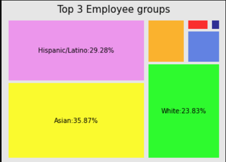
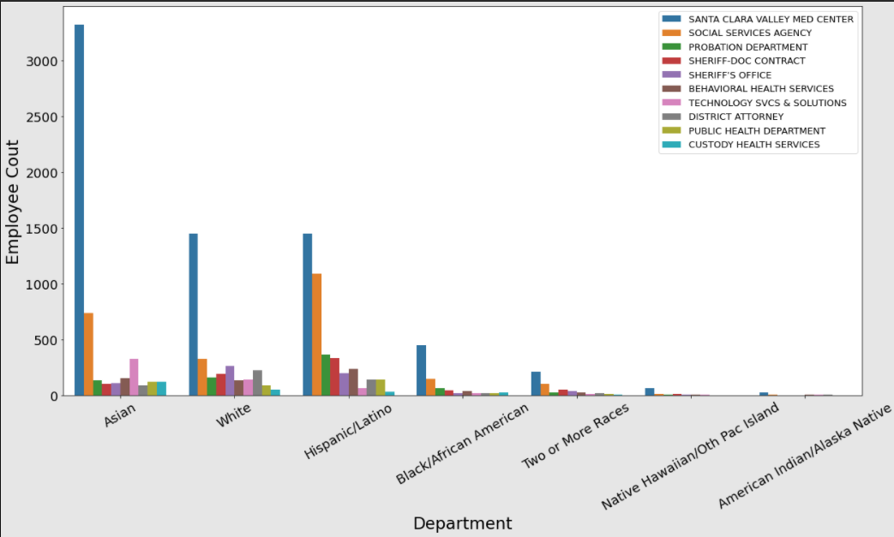

# scc-employee

In this EDA, we are going to explore the county workforce dataset and trying to answer below questions:  
1. How does the entire workforce look like in ethnicity? Which ethnicity has a higher percentage?What about in different job category and departments?  
2. Are there any associations between enthinicity and job category or which department the workforce is in?

<a href="https://data.sccgov.org/dataset/County-Workforce/tnhw-jtp5">Date Source</a> Last Updated atJanuary 21, 2021
  
## Structures:
1. Get the datasource by calling the portal API
2. Explore the data and clean the data if necessary
3. Create plots
4. Use Chi-Square test for associations between categories
5. Conclusions

## Laugange: Python  
## Tools: Pandas, Numpy, Matplotlib.pyplot, Seaborn, Socrata   

## Conclusions:

In the workforce:  

1. Almost 36% of the employees are Asian, 29% Hispanic and then followed by White employees, 24%.  
    

  
2. Among all the job categories, professionals, administrative support, protective service workers and technicians are the biggest groups. Asian employees dominiate professionals and Technicians job categories while, Hispanic employees dominate in job categories of Administrative Support and Protective Service Workers.  
    

3. In all the departments, most of the Asian employees work in Santa Clara Valley Med Center, same as Hispanic and White employee. Compared with Asian and White employees, there is a higher percentage of Hispanic employees work in the social services agency.  
    

4. As the results of Chi-square test, both results are significant, meaning there are associations between ethnicity and job cateogry and department respectively. However since the categories may not be completely independent from each other which violates the assumptions, we can not draw the conclusions that the association is actually there. 

